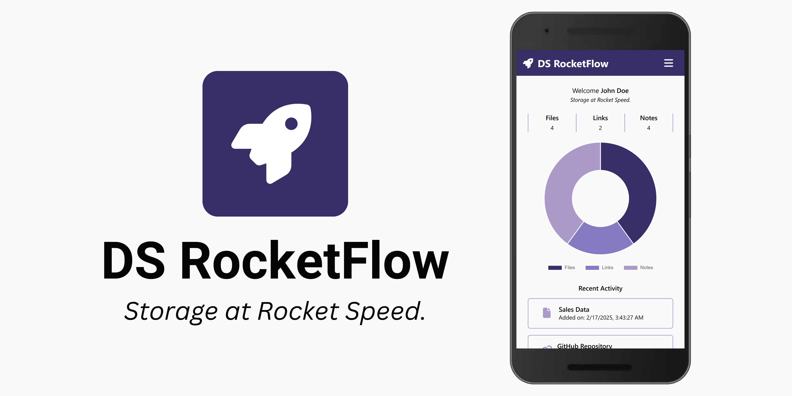
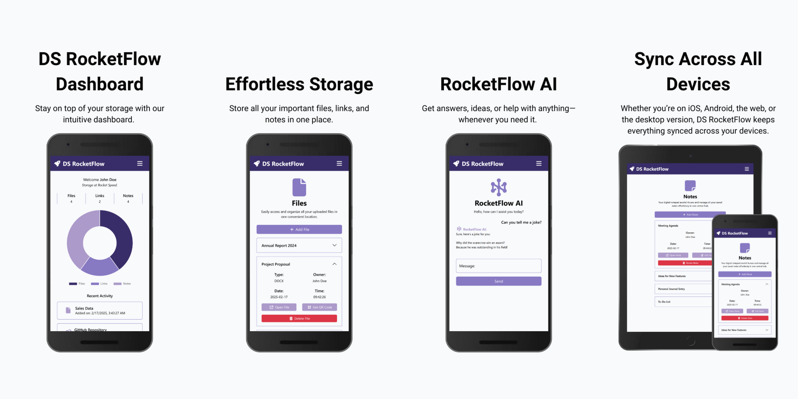

# DS RocketFlow

## _Storage at Rocket Speed._

DS RocketFlow is a cutting-edge cloud storage solution designed for simplicity, speed, and versatility. It empowers users to effortlessly store files, links, and notes that will sync seamlessly across all devices. With an intuitive interface, real-time storage insights, and the intelligence of RocketFlow AI for any query or task, it redefines what it means to stay organized in today’s fast-paced world. DS RocketFlow isn’t just storage—it’s smarter, faster, and built for you.

### Features

- Effortless Storage.
- RocketFlow AI.
- DS RocketFlow Dashboard.
- Sync Across All Devices.
- Top-Notch Security.

### Release Notes

- Bug Fixes.

###### DS RocketFlow | Version 1.1.5

See also: [DS RocketFlow - RESTful Web Service](https://github.com/dsvillalobos/ds-rocketflow-rest)
